# **Finding Lane Lines on the Road**

## Writeup Template

### You can use this file as a template for your writeup if you want to submit it as a markdown file. But feel free to use some other method and submit a pdf if you prefer.

---

**Finding Lane Lines on the Road**

The goals / steps of this project are the following:
* Make a pipeline that finds lane lines on the road
* Reflect on your work in a written report

### Reflection

### 1. Describe your pipeline. As part of the description, explain how you modified the draw_lines() function.

My pipeline consisted of 5 steps.
1. Convert the image into grayscale.

  
2. Blur the grayscale image with kernel size of 9
3. Use Canny method with the threshold of low = 50 and high = 150 to detect edges in the blur image.

  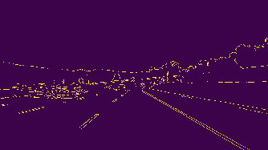
4. By looking at the image, I decided the vertices of the region of interest, and apply the mask using this region.

  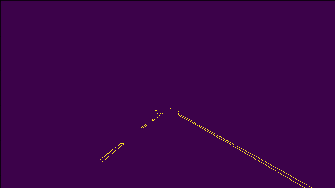
5. Find Hough lines using the Hough function on the masked image.
  While adjusting the parameter, I found several tips. If I have rho = 1, the Hough function will miss the dotted while line.

  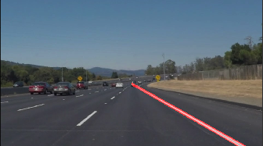

  If I have rho too big (like 9), he number of Hough lines will be too many and have a lot of small variations. See image.

  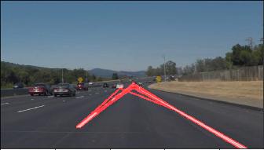

  With a bit of experiment, I found rho = 3 is the optimal. With theta being smaller, the lines are more concentrated.

  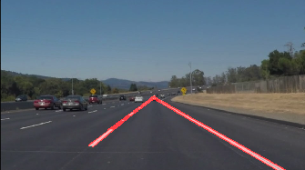

6. Filter the lines and find the left and right line and only draw them. This results only two solid lines, and the result photo is much cleaner.

  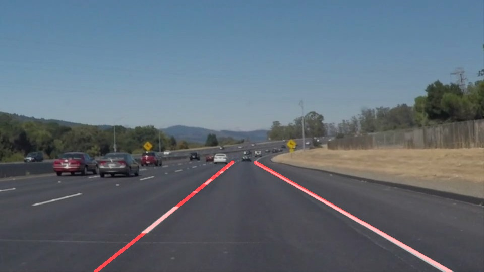

#### Extra challenge

Handling the challenge.mp4.
Without detecting left line and right line, the result looks messy

  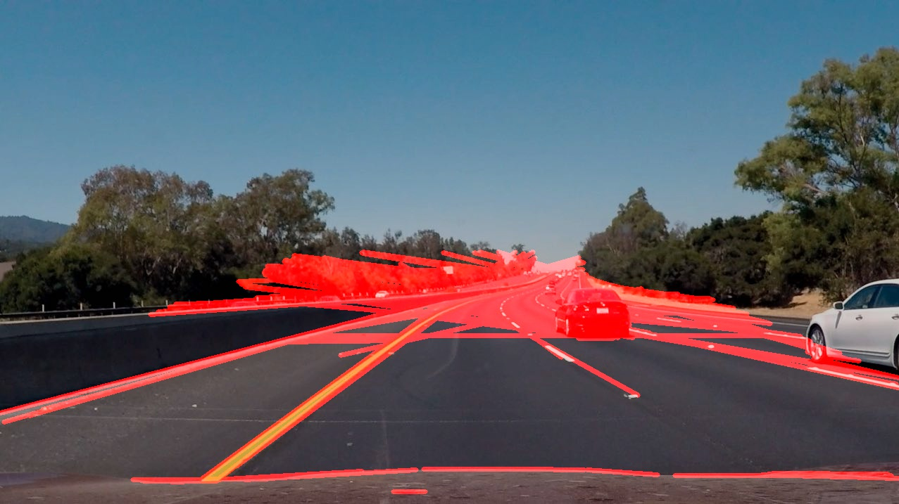

Even after I apply the left line and right line detections. The result still looks off.
  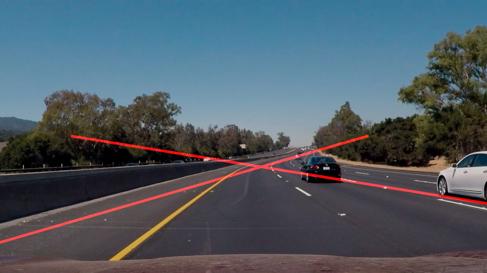

I added a heuristic filter on the degree of the lines. It will only accept lines with an angle with x-axis of degree 30 to 75 and -75 to -30. This effectively filters out most of the noise in the video.
See the test_videos_output/challenge.mp4 for my result.

  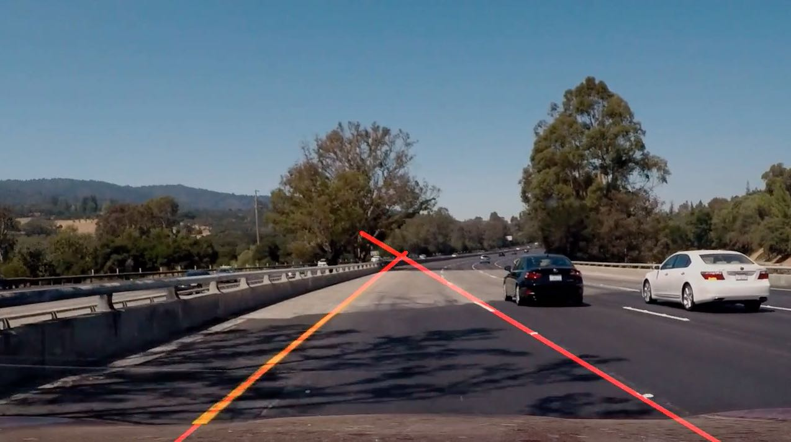


### 2. Identify potential shortcomings with your current pipeline

In the first version of the pipeline, I am using the following vertices. This is too arbitrary that it does not even fit an image with different resolution.
```
vertices = np.array([[(60, image.shape[0]),(450, 320), (510, 320), (900, image.shape[0])]], dtype=np.int32)
```    
  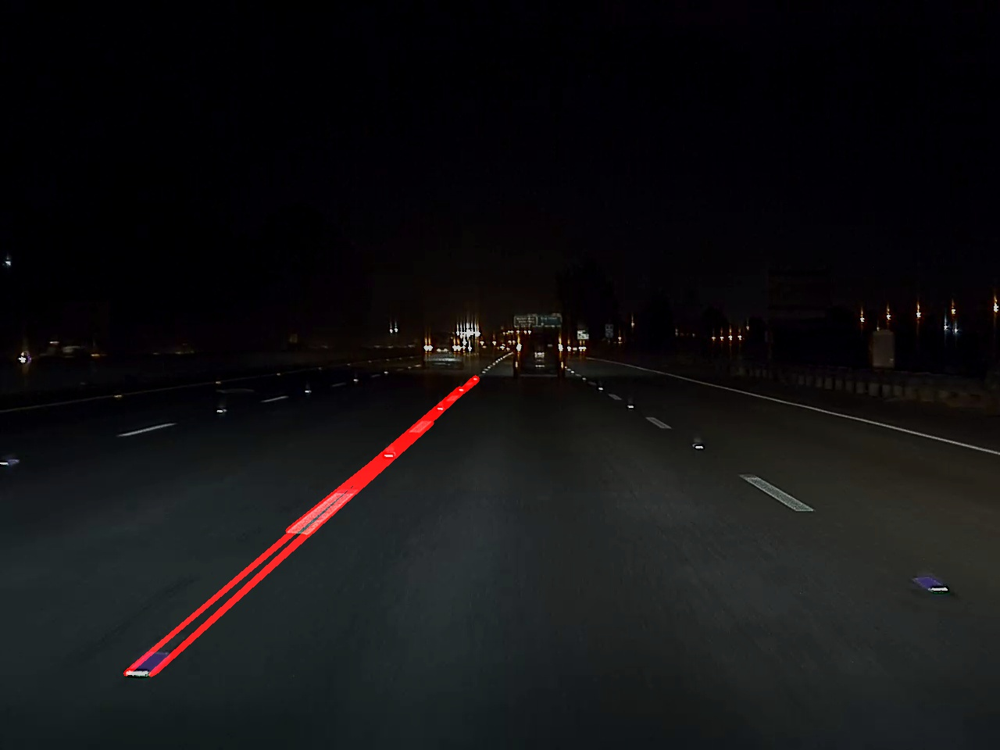

This does not sounds like too much of a problem because in real use case, the parameters are calibrated to each of the specific car model. I can assume the view from the same car will be fixed.

Still, my current approach have several drawbacks:
1. it will not adapt to case where there is a turn or car is going up hill or down hill. All these cases will fail the fix region approach.
2. Non-lane lines. Any lines which appears in the region of interest will be detected. The current algorithm cannot distinguish between the valid lines and the other lines. For example, in the challenge.mp4, there are many lines appears in the region of interest that messed things up.  

### 3. Suggest possible improvements to your pipeline

Build adaptive region detection.
1. detect all lines that appears in the lower half of the image. This is to make sure we capture all possible lane lines.
```
vertices = np.array([[(0, image.shape[0]),(0, image.shape[0]*3/4), (image.shape[1] / 3, image.shape[0] /2), (image.shape[1]*2/3, image.shape[0]/2), (image.shape[1], image.shape[0] *3/4), (image.shape[1], image.shape[0])]], dtype=np.int32)
```
With this setting, it is able to detect the line that is a bit off on the right.

   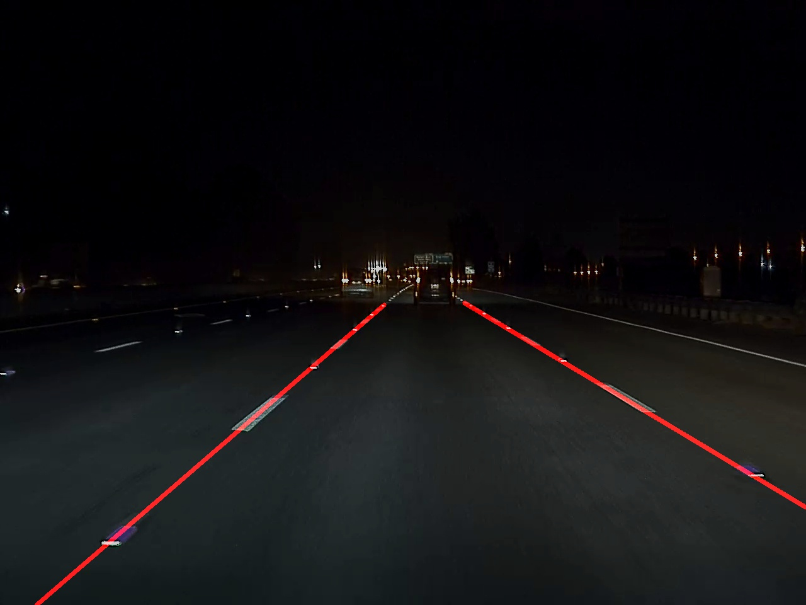
2. Because the nature of the lane lines will intercept at roughly the same point, we can find the point which is intercept at roughly the center of the view. It will pick only lines intercepts near the center of the image.
3. After that, we pick the two lines closes to the center vertical line.
